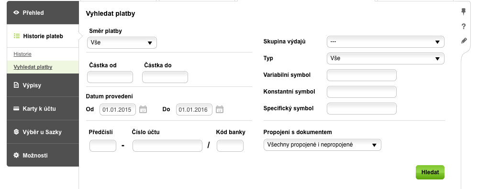

# AirBank Transactions

Docker image to download bank account transactions and read account balance 
from [AirBank](http://airbank.cz/) internet banking.

The Docker image is publicly available [here on DockerHub](https://hub.docker.com/r/mkrcah/airbank-tx/). 

## Rationale
As of now (September 2017), AirBank doesn't provide API to expose a list
of transactions. However, it is possible within the internet banking 
to export a list of transactions for a given bank account and time period.

This tool a workaround around the missing API. It uses a headless
Chrome browser to log into the AirBank internet banking and download
the CSV with transactions. 

It uses the following screen to download a list of transactions:

 

## Usage

```bash
docker run \
  --rm \
  --env AIRBANK_USERNAME="[username]" \
  --env AIRBANK_PASSWORD="[password]" \
  --volume [download-dir]:/data \
  --privileged \
  mkrcah/airbank-tx:latest \
  --period-from="[period-from]" --period-to="[period-to]" \
  --account-number="[account-number]" 
```

where
- `username` and `password` are login credentials to AirBank internet banking
- `account-number` is a bank account number whose transactions will be downloaded, for example `11111111111/3030`
- `period-from` and `period-to` defines time filter for transactions, in format `DD.MM.YYYY`
- `download-dir` a directory where the CSV file with transactions will be saved

There are two optional arguments available:
- `--export-filename [filename]` which specified name of the downloaded CSV file, e.g. `--filename "airbank.csv"`
- `--balance-filename [filename]` which specified name of a file to which current account balance will be stored

Login credentials can be also supplied via a file using the [`--env-file` flag](https://docs.docker.com/engine/reference/commandline/run/#/set-environment-variables-e-env-env-file).

Note: `--privileged` flag is required since Chrome is making use of unix containers as well. If not supplied, Chrome will not start. 
## Example:

```
$ cat env.list
AIRBANK_USERNAME=john.doe
AIRBANK_PASSWORD=super-secret-password

$ docker run --env-file=env.list \
   --volume $(pwd)/export-data:/data \ 
   --privileged mkrcah/airbank-tx \ 
   --period-from "01.01.2016" --period-to "01.07.2016" \
   --account-number "123456789/1234" \
   --export-filename "airbank.csv" \
   --balance-filename "airbank-balance.txt"
Starting chrome...
Loading login page
...
Done

$ ls ./export-data
airbank.csv
airbank-balance.txt
```


## Troubleshooting

Try to open internet banking manually and fill in provided data.
If not, try installing selenium and running the script locally.
If that doesn't help, or you find yourself lost, please open an issue.

## License
[MIT](http://choosealicense.com/licenses/mit/)


